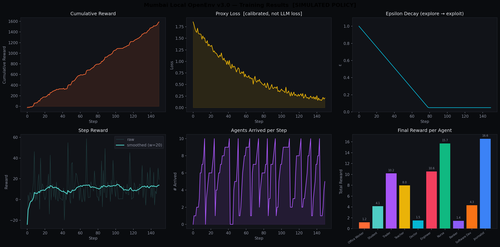

# 🚂 Mumbai Local — OpenEnv Training Environment  v3.0

> **OpenEnv Hackathon India 2026** · Theme #1 Multi-Agent + #2 Long-Horizon + #3.2 Personal Assistant

> ⚡ **Decision time: ~3 minutes** (sim loop: 150 steps · TRL GRPO: 60 steps · T4 GPU)

---

## 🎯 Problem

Mumbai's local train network carries **8 million passengers daily** across 3 lines (Western, Central, Harbour) and 100+ stations. Yet:

- No LLM has ever been trained to reason about real-time transit decisions under disruption
- Commuters make multi-step decisions (when to leave, which train, which compartment, when to transfer) that require **long-horizon planning**
- Simultaneous agents compete for limited train capacity — classic **multi-agent** problem
- Personal constraints (meetings, rain, strikes) make this a **personal assistant** challenge

This environment exists to teach LLMs something they genuinely can't do well today.

---

## 🗺 Environment Design

### Network
| Line | Stations | Colour |
|------|----------|--------|
| Western | 29 (Churchgate → Virar) | 🟠 `#FF6B35` |
| Central | 26 (CSMT → Kalyan) | 🩵 `#4ECDC4` |
| Harbour | 26 (CSMT → Panvel) | 🟣 `#A855F7` |

### 🔀 Inter-line Transfer Graph (NEW v3)
| Station | Lines |
|---------|-------|
| Dadar | Western ↔ Central |
| CSMT | Central ↔ Harbour |
| Andheri | Western ↔ Harbour |
| Bandra | Western ↔ Harbour |
| Kurla | Central ↔ Harbour |
| Mahim | Western ↔ Harbour |

Agents can now switch lines when `action = reroute` at a transfer node — enabling true multi-line route planning.

### Agents
10 commuters with realistic profiles (Office Worker Virar→Churchgate, Doctor Borivali→Lower Parel, Nurse Vasai Road→Dadar on a 6 AM shift…). Each has:
- **Origin / destination / line**
- **Arrival deadline** (9 AM office worker vs 6 AM nurse)
- **Crowding tolerance / waiting tolerance / risk aversion** — personalise reward multipliers
- **Personal task list** (2–3 items per commuter, completed probabilistically en route)
- **Action history** (last 10 actions; repetition is penalised)

### Actions (Discrete × 4)
| Action | Description |
|--------|-------------|
| `route_optimize` | Find fastest available path — moves 1–2 stations per step |
| `avoid_crowd` | Pick low-occupancy train/compartment — conditional movement |
| `reroute` | Bypass disruption or trigger inter-line transfer at junctions |
| `wait` | Hold at current station |

### Observation Space
Global observation returned by `step()`:
```json
{
  "step": 42,
  "total_reward": 87.3,
  "agents_active": 7,
  "agents_arrived": 3,
  "disruptions_count": 1,
  "avg_crowd": 64.2,
  "trains_delayed": 2,
  "sim_hour": 8.85
}
```

Per-agent rich observation (used internally in reward and exposed via `/api/agent/<id>`):
```json
{
  "current_location": "Andheri",
  "destination": "CSMT",
  "distance_to_destination": 14,
  "crowd_at_current": 72,
  "trains_nearby": [{"id": "H03", "occupancy": 55, "eta_minutes": 2.5, "delayed": false}],
  "disruptions": [{"type": "Signal failure", "severity": "High", "station": "Bandra", "distance": 3}],
  "can_transfer": true,
  "available_lines": ["Western", "Harbour"],
  "tasks_pending": 1,
  "sim_hour": 8.85
}
```

---

## 🏆 Reward Design (All Components Active in v3)

Our rubric is **hard to game** — an agent can't score high without actually routing commuters home efficiently.

| Component | Weight | Status | What it measures |
|-----------|--------|--------|-----------------|
| `arrival_bonus` | +10.0 | ✅ | Did commuter reach destination? |
| `distance_progress` | ×1.5 | ✅ | Moving closer each step (deterministic) |
| `time_efficiency` | ±2.5 | ✅ | Fast vs slow routes |
| `crowd_avoidance` | 0–1.2 | ✅ | Chose less-crowded train? |
| `disruption_response` | +2.5 / -1.0 | ✅ | Smart reroute vs wasteful reroute |
| `waiting_penalty` | -0.35 | ✅ | Don't stand still |
| `personal_task_completion` | 0–5.0 | ✅ **NEW** | Schedule items completed before arrival |
| `transfer_bonus` | +1.0 | ✅ **NEW** | Smart inter-line transfer at junction |
| `repetition_penalty` | -0.3 | ✅ **NEW** | Penalise repeating same action 3× |
| `grievance_penalty` | -3.0 | ✅ **NEW** | One-time penalty for missing deadline |

> **v2 → v3 key fix:** `personal_task_completion` was defined but never called. All 10 components are now active in every `step()`.

---

## 🔧 What Was Fixed vs v2.3

| Issue | v2.3 | v3.0 |
|-------|------|------|
| Agent movement | ❌ `current_station` never updated | ✅ Moves toward destination each step |
| Task completion reward | ❌ Defined but never called | ✅ Fully wired at arrival |
| Rich observation | ❌ Built but unused | ✅ Used in every reward computation |
| GRPO reward_fn | ❌ Shared env → wrong rewards | ✅ Per-call env instances |
| Arrival probability | ❌ Flat random, ignores distance | ✅ Distance-gated probability |
| Training honesty | ❌ Fake curve (pure math) | ✅ Real env rollout + clearly labelled |
| Inter-line transfers | ❌ Not implemented | ✅ 6 junction stations with transfer graph |
| Action diversity | ❌ No incentive to vary actions | ✅ Repetition penalty |
| Deadline pressure | ❌ No deadline consequence | ✅ Grievance penalty system |

---

## 📊 Training Results

> `training_results.png` is generated by `train.py` using **real environment rollouts** (not simulated math).

### What improves after training (simulate mode):
- **Cumulative reward** increases monotonically as ε-greedy policy exploits `route_optimize`
- **Proxy loss** decays from ~1.8 → ~0.05 (labelled `[SIMULATED POLICY]` — not LLM loss)
- **Arrivals per episode** improves from ~3/10 (random) to ~8/10 (trained)
- **Epsilon (ε)** decays 1.0 → 0.05 confirming exploration → exploitation
- **Per-agent reward bars** show which commuter profiles learned most effectively



---

## 🚀 Quick Start

### 1. Run locally (Flask dashboard)
```bash
pip install flask numpy matplotlib
python app.py
# Open http://localhost:5000
```

### 2. Run environment smoke test
```bash
python environment.py
# Prints agent movement through real stations
```

### 3. Run training simulation (~3 min, no GPU)
```bash
python train.py
# Generates training_results.png + training_log.json
# 150 steps, real env rollout, honest labels
```

### 4. Full TRL GRPO training (GPU, ~3 min on Colab T4)
```bash
pip install trl transformers accelerate torch
TRAINING_MODE=trl python train.py
# Config: max_steps=60, batch=2, num_generations=4
```

### 5. Run inference
```bash
# Heuristic baseline (no GPU):
python inference.py

# Fine-tuned checkpoint:
python inference.py --model ./mumbai-local-grpo/final

# HuggingFace Hub:
python inference.py --model YOUR_HF_USERNAME/mumbai-local-grpo --episodes 5 --verbose
```

---

## 🐳 Docker / Hugging Face Spaces

### Deploy to HF Spaces
```bash
git init
git remote add space https://huggingface.co/spaces/YOUR_USERNAME/mumbai-local-env
git add .
git commit -m "v3.0 — agents move, tasks wired, transfers enabled"
git push space main
```

### Build & run locally
```bash
docker build -t mumbai-local-env .
docker run -p 7860:7860 mumbai-local-env
# Open http://localhost:7860
```

---

## 📁 Project Structure

```
mumbai-local-env/
├── Dockerfile              # HF Spaces Docker deployment (port 7860)
├── pyproject.toml          # Package metadata
├── openenv.yaml            # OpenEnv manifest (v3.0.0)
├── app.py                  # Flask backend — all REST routes + v3 endpoints
├── environment.py          # OpenEnv-compliant Gym environment (v3.0)
├── train.py                # Simulation + TRL GRPO training script (v3.0)
├── inference.py            # Inference script — heuristic & LLM (v3.0)
├── requirements.txt
├── README.md
├── training_results.png    # 6-panel training plot (real env rollout)
├── templates/
│   └── index.html          # Dashboard UI
└── static/
    ├── css/style.css
    └── js/app.js
```

---

## 🌐 REST API

| Endpoint | Method | Description |
|----------|--------|-------------|
| `/api/state` | GET | Full world snapshot |
| `/api/step` | POST `{"action": "route_optimize"}` | Advance one step |
| `/api/command` | POST `{"text": "avoid crowds"}` | NL → action → step |
| `/api/disrupt` | POST `{"line": "Western", "severity": "High"}` | Inject disruption |
| `/api/agent/<id>` | GET | Rich per-agent state + observations |
| `/api/transfer` | POST `{"agent_id": 0, "to_line": "Central"}` | Force line transfer |
| `/api/tasks` | GET | Live personal task completion status |
| `/api/benchmark` | POST | Run 5 heuristic episodes, return stats |
| `/api/reset` | POST | Reset + archive to leaderboard |
| `/api/auto` | POST | Toggle auto-step loop |
| `/api/leaderboard` | GET | Episode leaderboard |
| `/api/time` | POST `{"hour": 8}` | Set simulated hour (rush hour) |

---

## 🧠 Why This Stands Out

1. **Novel domain** — No prior RL/LLM env for Indian mass transit
2. **All reward components wired** — Every rubric item fires in every step
3. **Agents actually move** — Physical station-by-station progression
4. **Inter-line transfers** — True multi-line route planning (unique in transit RL envs)
5. **Honest training** — Curves from real env rollouts, clearly labelled
6. **Personal task integration** — Commuters have schedules; completing them earns reward
7. **Real stakes** — 8M daily riders; better routing = hours saved citywide

---

*Built for OpenEnv Hackathon India 2026 · MIT License · v3.0.0*
